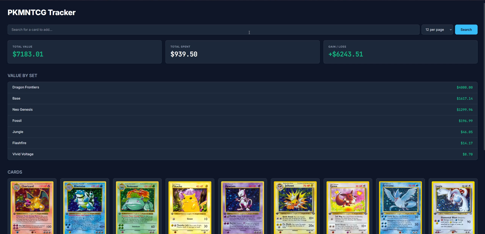
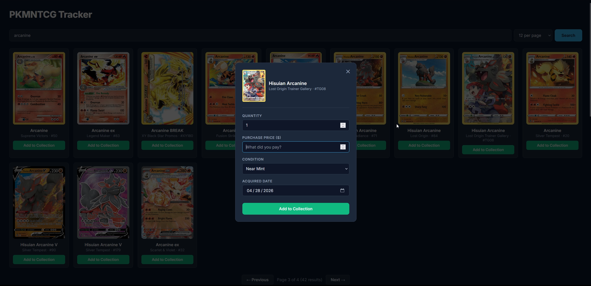

# Pokémon TCG Collection Tracker

A personal Pokémon Trading Card Game collection tracker with live pricing, statistics, and a search-driven acquisition flow. Built as a full-stack project to learn SQL, REST APIs, and modern web fundamentals.

## Features

- **Live pricing** — fetches current market values from the Pokémon TCG API
- **Collection dashboard** — total value, total spent, gain/loss, and value-by-set breakdown
- **Search & acquire** — search the entire Pokémon TCG catalog with paginated results, click to add cards to your collection
- **Local-first storage** — SQLite database, no cloud dependencies
- **Resilient price refresh** — batch refresh handles individual API failures without aborting

## Screenshots





## Tech stack

**Backend**
- Python 3.11
- FastAPI — REST API framework
- SQLite — local database
- `requests` — Pokémon TCG API client

**Frontend**
- Vanilla HTML / CSS / JavaScript (no framework)
- Inter + JetBrains Mono via Google Fonts
- CSS Grid for responsive layout

**Architecture**
- `db.py` — database access layer
- `api.py` — Pokémon TCG API client
- `collection.py` — service layer bridging the API and the database
- `web.py` — FastAPI HTTP layer
- `seed.py` — reproducible test data setup
- `static/index.html` — single-page frontend

## Running locally

Requires Python 3.11+ installed.

```bash
# Clone the repo
git clone https://github.com/RodarteJake/pokemon-tcg-tracker.git
cd pokemon-tcg-tracker

# Set up a virtual environment
python -m venv venv
.\venv\Scripts\Activate.ps1   # On Windows
# source venv/bin/activate    # On macOS/Linux

# Install dependencies
pip install -r requirements.txt

# Seed the database with sample data
python seed.py

# Run the web server
uvicorn web:app --reload
```

Then open http://127.0.0.1:8000 in your browser.

## Auth

Visitors get read-only access. To add, edit, delete, or refresh prices, you log in with a single shared password.

Required env vars:

- `EDIT_PASSWORD` — the password the editor types in. If unset, login is disabled and the site is read-only.
- `SESSION_SECRET` — used to sign the session cookie. If unset, a random one is generated at startup (sessions expire on restart, fine for dev).
- `COOKIE_SECURE` — set to `true` in production (HTTPS-only cookie). Defaults to `false` for local dev.

For local dev, `EDIT_PASSWORD=hunter2 uvicorn web:app --reload` is enough.

For Fly:

```bash
flyctl secrets set EDIT_PASSWORD='<long random password>'
flyctl secrets set SESSION_SECRET="$(python -c 'import secrets; print(secrets.token_hex(32))')"
```

`COOKIE_SECURE=true` is already set in `fly.toml`.

## Data sources

Card data and pricing courtesy of the [Pokémon TCG API](https://docs.pokemontcg.io/), with prices from TCGPlayer.

## License

MIT — see LICENSE file

## Credits

Favicon: [Pokemon icons created by Freepik - Flaticon](https://www.flaticon.com/free-icons/pokemon)